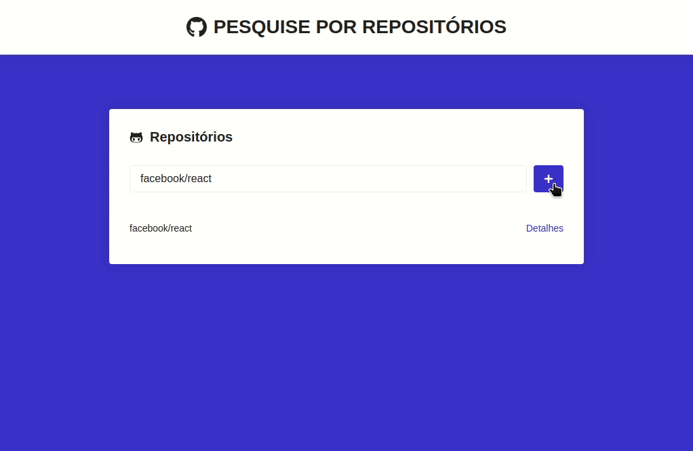

<h1 align="center">GITHUB REPOSITORIES</h1>



## Built With

* [ReactJs](https://reactjs.org/) -
 ```to create our PWA```
* [Axios](https://github.com/axios/axios) -
```to make the API call```

## About

Front-end of a simple application that makes a REST request to the [GitHub](https://developer.github.com/v3/repos/) API, stores the request data in the browser's LocalStorage, avoiding making a new request. In addition to listing the repositories, it also shows the issues made in that repository.

## Objective

Understand how to obtain information from a REST API, using that of GitHub as an example.

## How to test?

You'll need [Node.js](https://nodejs.org) installed on your computer to test this website.

```bash
$ git clone https://github.com/benmacario/api-github-repository.git

#
$ cd api-github-repository

# Installing dependencies
$ yarn install

# Starting project in dev mode
$ yarn start
```

## LICENSE

This project is under the MIT license. See the [LICENSE](LICENSE) file for more details.

---